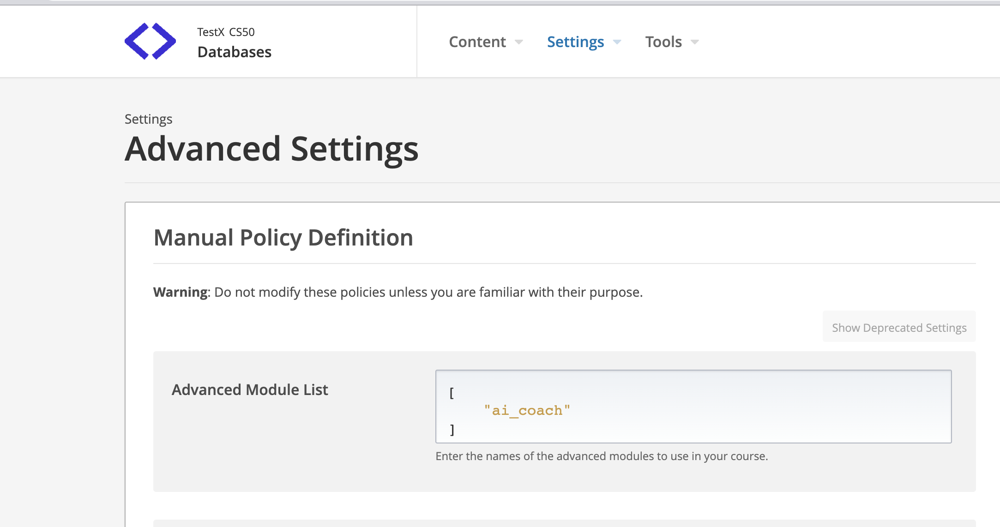
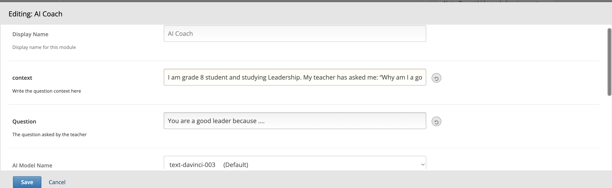
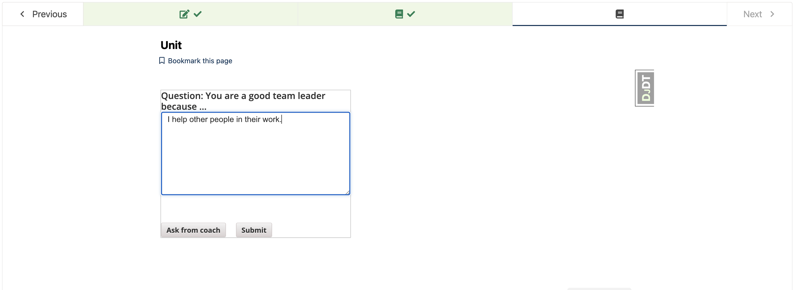
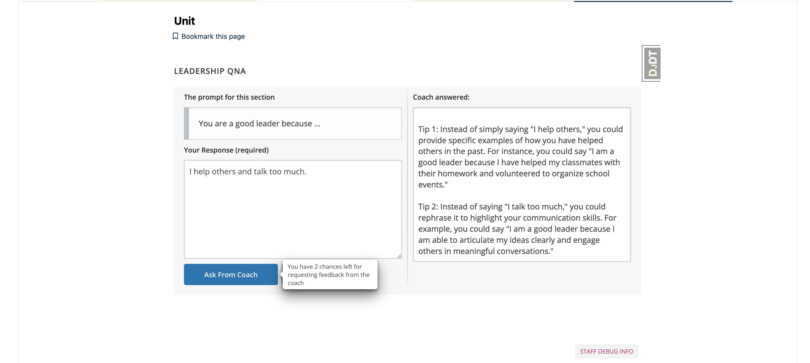
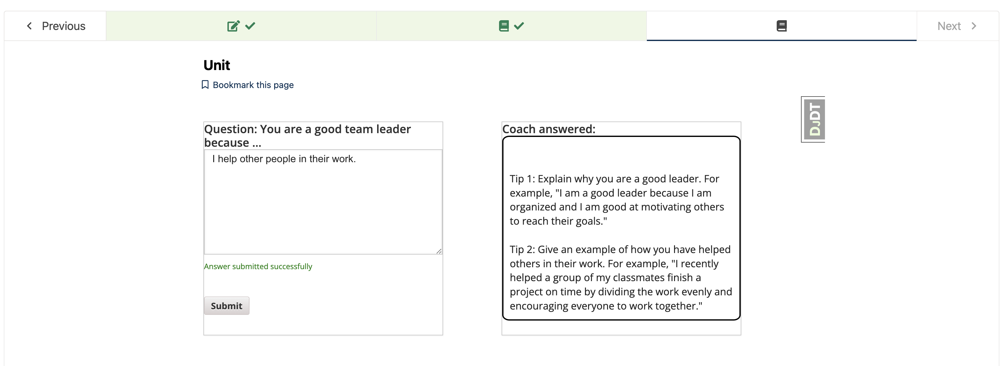
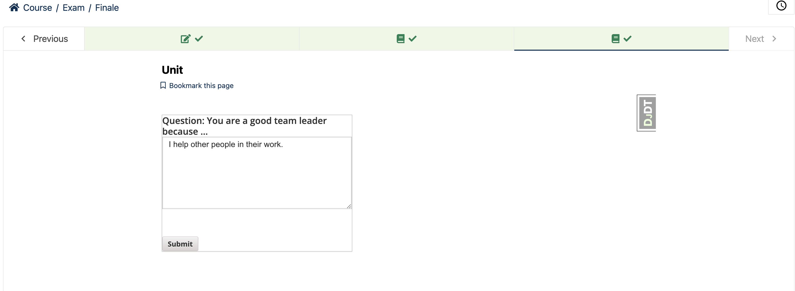

# **AI Coach XBlock**

AI Coach Xblock helps learner in improving their answers by levering power of AI. It evaluates open response answer of a question using Open AI and provides feedback to learner.

It has the followig features:

1. Helps learner to get feedback on their open response answer using Open AI
2. Learner can improve answer on the basis of Open AI feedback
3. Ability to mark Question complete in open edX
4. Save learner answer which can be retrieved later


## **Setup**

```bash
pip install ai-coach-xblock
```

### **Update  Settings of LMS and CMS**
Add the OPEN AI secret key in the lms and cms configuration file
```python
OPENAI_SECRET_KEY='set-secret-key'
```

### **Update Advanced Settings of course**
Update course advanced settings by adding `ai_coach` as shown in below image



### **Update settings of AI Coach Component**

AI Coach Xblock will be available in Advanced component of course unit now. Add "AI Coach" xblock in unit and click "Edit" button to
add `question` & `question context` and configure it.

> `Context` is the context of question with answer which is provided to OpenAI for feedback generation. Question and Learner Answer is integrated into context using `{{question}}` and `{{answer}}` keywords which automatically picks question & learner aswer value. 
> Example: 
```I am grade 8 student studying leadership. My teacher asked me question: {{question}} . I answered {{answer}} . Provide two tips to improve my answer as a grade 8 student. ```   





### **Publish Content**

Use "Preview" button to preview it or publish your content and use "View Live Version" button to see how it appears on LMS




### **Ask For Feedback**

After adding answer, learner click on `Ask from Coach` button for feedback. Feedback is provided by OPEN AI on the basis of question context and answer. 

> "**Ask from Coach**" button disappears when the feedback threshold (Maximum no. of times one can request for feedback) is reached. By default, feedback threshold is 1.




### **Submitting Answer**

Submit button saves the learner answer and mark the completion of Xblock.



